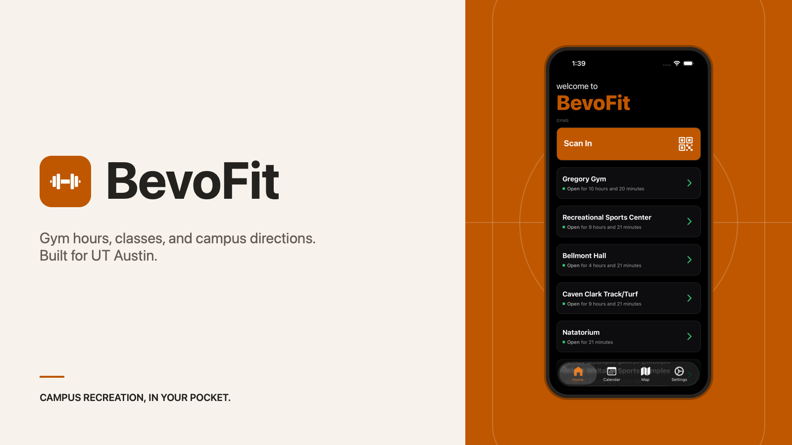
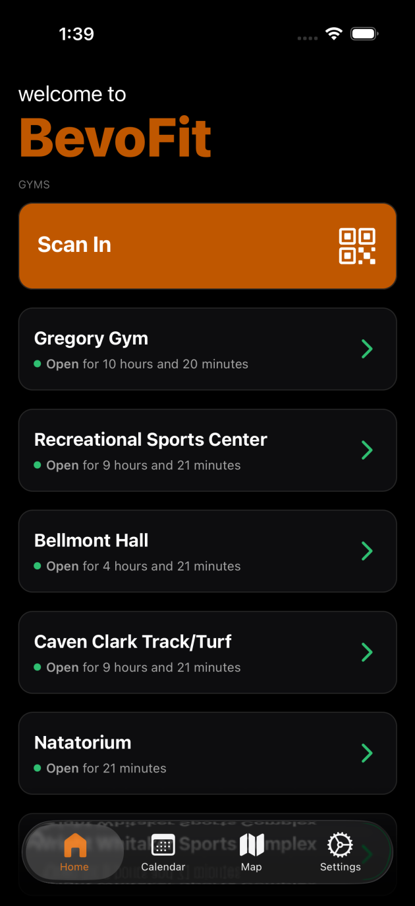
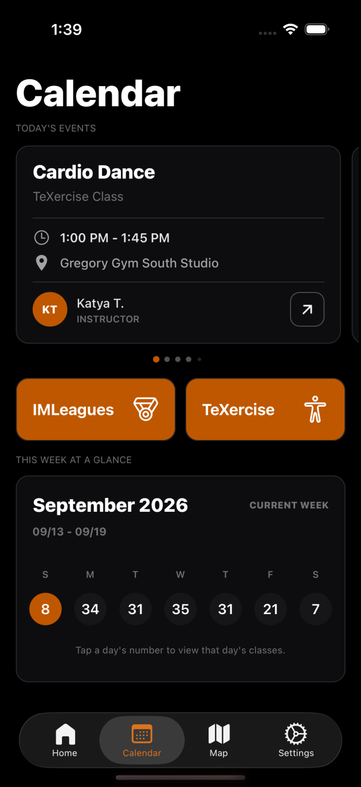
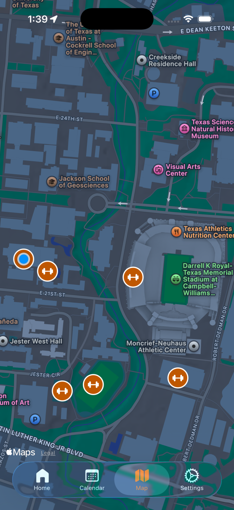
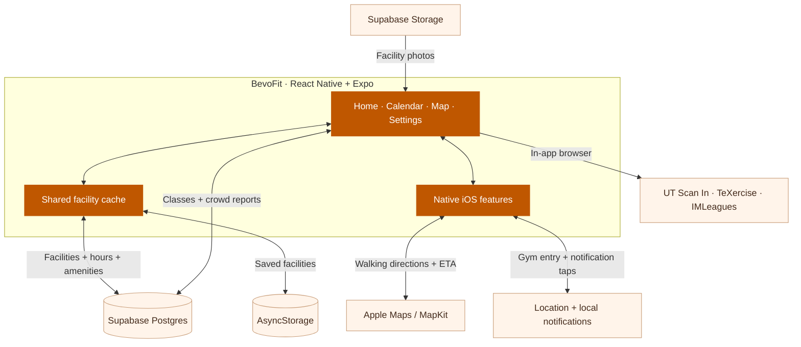

<p align="center">
  
</p>

<p align="center">
  <a href="https://apps.apple.com/us/app/bevofit/id6758592301"></a>
</p>

<p align="center">
  <a href="#the-app">The app</a> · <a href="#how-it-works">Architecture</a> · <a href="#run-locally">Run locally</a> · <a href="docs/app-store-release.md">Release guide</a>
</p>

# BevoFit

A little less planning, a little more time at the gym. BevoFit brings UT Austin RecSports hours, facilities, and classes into one app, so you can find an open gym, fit a class between lectures, and get walking directions across campus.

Browsing doesn't require a BevoFit account. Scan In, TeXercise, and IMLeagues open the relevant UT services, where you sign in with your UT credentials when required.

## The app

| Find a place | Make a plan | Get there |
| :--- | :--- | :--- |
|  |  |  |
| See which gyms are open and how long you have before closing. Check facility photos, amenities, activities, and weekly hours. | Browse today's RecSports classes and the week ahead, with times, instructors, and studios. Open TeXercise or IMLeagues from the calendar. | Explore the campus map, view a facility's address, and get Apple Maps walking directions with an estimated walk time when available. |

There are a few useful extras, too:

- **Crowd reports.** Share how busy a gym feels and see an estimate based on reports from the last 30 minutes.
- **Nearby Gym Alerts.** Opt in to notifications when you're near an open gym. Tapping an alert opens that gym's details.
- **Saved gym info.** Previously loaded facility data can appear immediately while the app refreshes, including when a connection drops.
- **Your preferred appearance.** Choose Light, Dark, or System Default. iOS 26 uses native tabs, with a classic tab bar on older versions.

## How it works

The Expo app talks directly to Supabase for facility data, class schedules, crowd reports, and images. Maps, walking estimates, and nearby alerts use native device services.



**Hours follow Austin time.** Open status is calculated from stored schedules in `America/Chicago`, including special-date overrides. The class calendar uses the same time zone.

**Facility requests are shared.** Home, Map, and Calendar use the same cache. It reuses fresh results for five minutes, restores saved catalogs up to 24 hours old, and preserves loaded data when a refresh fails.

**Nearby alerts run on the phone.** With notifications and Always/Precise location access enabled, iOS monitors gym boundaries. The app checks opening hours, overlapping facilities, and notification cooldowns before sending an alert.

**Crowd levels come from people.** The app averages recent submissions, with one report per device and facility. These are community estimates, not occupancy sensor readings.

<details>
<summary><strong>Data model</strong></summary>

The client expects these Supabase tables and storage bucket:

| Resource | Used for |
| :--- | :--- |
| `facilities` | Names, coordinates, addresses, image paths, descriptions, and nearby-alert configuration |
| `facility_hours` | Weekday schedules and special-date hours, related by `facility_id` |
| `facility_activities` | Activities available at each facility |
| `facility_features` | Facility amenities |
| `classes` | Class name, day, time, studio, instructor, and activity type |
| `busyness_reports` | Crowd level, timestamp, facility, and device identifier; upserts use `(facility_id, device_id)` |
| `facility-imgs` | Facility photos in Supabase Storage |

Database migrations and seed data are not included in this repository. A fresh Supabase project needs the corresponding tables, relationships, data, and access policies before the app can load content.

</details>

## Run locally

Use Node.js 20.19.4 or newer, npm, and a Supabase project with the app's data. For iOS development, use macOS with Xcode and an installed simulator runtime.

```sh
npm ci
```

Create `.env` in the project root:

```dotenv
EXPO_PUBLIC_SUPABASE_URL=https://your-project.supabase.co
EXPO_PUBLIC_SUPABASE_PUBLISHABLE=your-publishable-key
```

Use a public publishable or legacy anon key. `EXPO_PUBLIC_` values are bundled into the app, so an administrative or service-role key does not belong here.

Build and launch the iOS development client:

```sh
npm run ios
```

For later sessions with the development client already installed:

```sh
npm start
```

A native development build is required for the local Swift modules and native features. Expo Go does not contain those modules. Android has a build command (`npm run android`), but the custom walking-time and nearby-alert features are implemented for iOS.

To check a change:

```sh
npm test
npm run typecheck
```

The tests cover calendar time handling, facility caching, gym details, geofencing, overlapping gym boundaries, notification routing, and release environment validation. Build and submission steps are in the [App Store release guide](docs/app-store-release.md).

<details>
<summary><strong>Find your way around the code</strong></summary>

| Path | What's there |
| :--- | :--- |
| [`src/app/`](src/app/) | Expo Router routes, native tabs, and app providers |
| [`src/screens/`](src/screens/) | Home, Calendar, Map, and Settings screens |
| [`src/hooks/useFacilities.ts`](src/hooks/useFacilities.ts) | Shared facility subscription for the screens |
| [`src/lib/`](src/lib/) | Supabase client, cache, hours, calendar time, walking estimates, and nearby alerts |
| [`src/contexts/`](src/contexts/) | Appearance, nearby-alert preferences, notification routing, and preview mode |
| [`modules/location-accuracy/`](modules/location-accuracy/) | Local Expo module with Swift implementations for location accuracy and MapKit walking times |
| [`tests/`](tests/) | Node test suite |
| [`backend/`](backend/) | Earlier Python and ML scanner experiments, outside the current app's runtime |

The UI uses TypeScript, React Native, Expo Router, NativeWind, Reanimated, and Gorhom Bottom Sheet. Maps use `react-native-maps`; data and images come from Supabase.

</details>

## Contact

Built by [Sriram Sattiraju](mailto:sriramsattiraju07@gmail.com). Suggestions and bug reports are welcome through [GitHub issues](https://github.com/srirsatt/gymScanner/issues) or email.

[MIT license](LICENSE) · [Privacy policy](https://srirsatt.github.io/BevoFit/privacy-policy.html)
