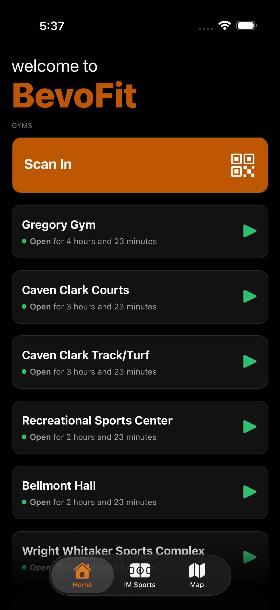
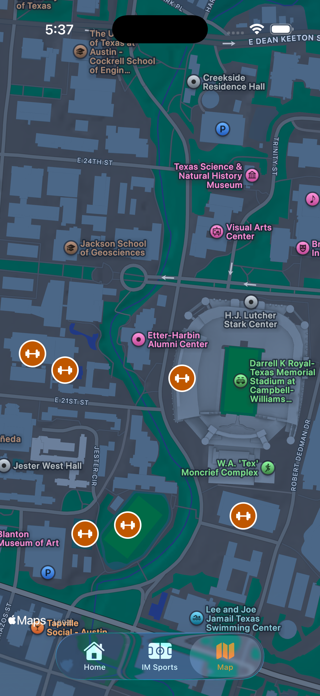
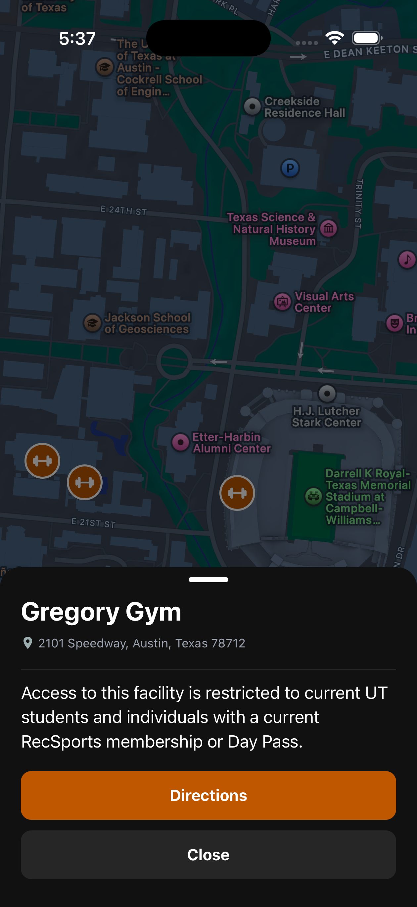
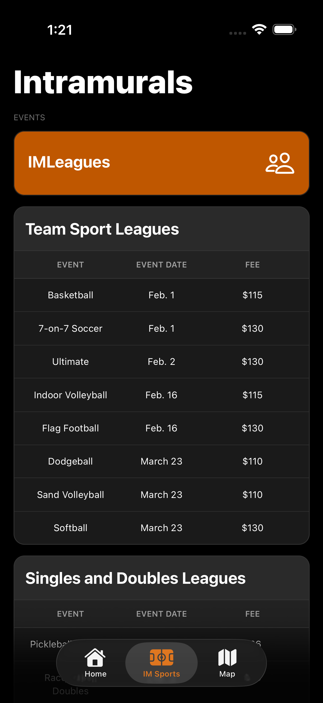

# BevoFit

A React Native mobile app for University of Texas students to view gym facilities, hours, and intramural sports information.

<a href="https://apps.apple.com/us/app/YOUR-APP-ID">
  
</a>


## Overview

BevoFit provides quick access to UT Recreational Sports facilities and intramural programs. Users can check gym hours, see what's open now, view facility details, and browse upcoming intramural events.

## Screenshots
<div style="display: flex; gap: 10px;">
  
  
  
  
</div>

## Features

- Real-time gym hours and open/closed status
- Facility information including activities, features, and addresses
- Interactive map of gym locations
- Intramural sports schedules and registration information
- Quick access to IMLeagues and scan-in portal
- Pull-to-refresh for latest data

## Tech Stack

- React Native with Expo
- TypeScript
- Supabase (database and storage)
- React Navigation
- NativeWind (Tailwind CSS for React Native)
- React Native Reanimated

## Project Structure

```
src/
├── screens/
│   ├── Home.tsx         # Main gym listing and details
│   ├── Map.tsx          # Map view of facilities
│   └── Intramurals.tsx  # Intramural events and schedules
└── lib/
    └── supabase.ts      # Supabase client configuration
```

## Database Schema

### facilities
- Basic facility info (name, location, images)
- Related tables: facility_hours, facility_activities, facility_features

### intramurals
- id, category, event_name, event_fee, reg_dates, event_dates
=
## Setup

1. Install dependencies: `npm install`
2. Configure environment variables:
   - EXPO_PUBLIC_SUPABASE_URL
   - EXPO_PUBLIC_SUPABASE_PUBLISHABLE
3. Run: `npx expo start`

## Notes

- All times are displayed in Central Time (Austin, TX)
- Facility images are stored in Supabase Storage

## Contact
Contact Sriram Sattiraju (sriramsattiraju07@gmail.com) for any suggestions! Thank you!
